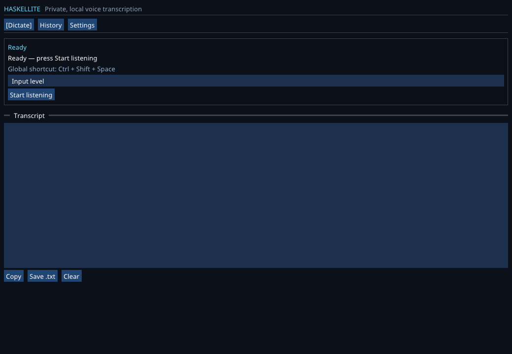
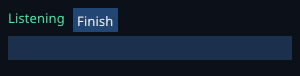

# Haskellite

<p align="center">
  
  <br>
  <sub>Full dictation workspace</sub>
</p>

<p align="center">
  
  <br>
  <sub>Compact, non-activating background listening overlay</sub>
</p>

Haskellite is a private desktop voice-to-text app written in Haskell for Linux
and macOS. Press a global shortcut from any application, speak, and Haskellite
transcribes locally with NVIDIA Parakeet before returning the text to the field
you were using.
No account, cloud API,
Python process, or network connection is needed after the one-time model setup.

## What is implemented

- Native desktop UI on Linux and macOS through SDL2 and Dear ImGui.
- Background system-tray service and a recordable custom shortcut that supports
  either toggle or hold-to-talk dictation.
- Non-activating compact listening overlay, automatic stop on trailing silence,
  and generated start/finish audio cues.
- Clipboard-backed focused-field delivery on macOS and X11. Secure
  Wayland sessions retain the transcript on the clipboard when synthetic paste
  is not permitted by the compositor.
- Float PCM microphone capture with device selection and a live level meter.
- Haskell voice-activity segmentation with pre-roll, configurable sensitivity,
  trailing-silence detection, and a maximum phrase length.
- Three checksum-pinned Parakeet choices: multilingual 600M, English Quality
  600M, and English Fast 110M.
- Automatic punctuation, capitalization, and language detection from Parakeet.
- Editable transcript, clipboard copy, and timestamped UTF-8 text export.
- Durable per-activation dictation history with one-click copy.
- First-run model/runtime installer with streaming progress and pinned SHA-256
  checksums.
- Headless install, diagnostics, microphone check, and WAV transcription tools.
- Automated tests for segmentation, WAV handling, checksums, and asset discovery.

The handwritten application and binding code is Haskell (`.hs`/`.hsc`). There
is no C shim and no Python sidecar. Like any Haskell desktop app, Haskellite uses
native system libraries: SDL2 for windows/audio and sherpa-onnx/ONNX Runtime to
execute the NVIDIA model. Those libraries are loaded through Haskell FFI.

## Recent improvements

- **Fully custom shortcuts:** record combinations such as
  **Command+Shift+A**, **Command+Control+Shift+A**, or a modified punctuation,
  navigation, number, or function key. Custom bindings are validated, saved,
  restored at launch, and translated to the native macOS and Linux listeners.
- **Push-to-talk:** optionally hold the shortcut to record and release it to
  finish. Toggle mode remains available.
- **Background-first behavior:** shortcut dictation displays a compact overlay
  without activating Haskellite, so the insertion cursor stays in the app where
  dictation began.
- **Reliable macOS delivery:** Haskellite remembers the previously active app,
  requests Accessibility access when needed, and posts a complete Command+V
  chord after transcription.
- **Faster completion:** the finish sound no longer blocks delivery, and the
  clipboard-to-paste handoff starts almost immediately after recognition.
- **Focused support matrix:** Linux and macOS are built in CI. Windows source is
  retained for later work but Windows builds and checks are currently disabled.

## Quick start

Install GHC 9.10.3 and Cabal 3.16 (the easiest route is
[GHCup](https://www.haskell.org/ghcup/)), plus the SDL2 and bzip2 development
packages for your OS.

```bash
cabal update
cabal build all
cabal run haskellite
```

On first launch, choose **Install Parakeet**. The download is about 473 MB and
uses roughly 670 MB after extraction. It is stored in the platform data folder,
not in the source checkout.

Common dependency commands:

```bash
# Ubuntu / Debian
sudo apt install libsdl2-dev libbz2-dev libx11-dev libxtst-dev pkg-config g++

# Arch / CachyOS
sudo pacman -S sdl2 bzip2 libx11 libxtst pkgconf gcc

# macOS
brew install sdl2 sdl3 bzip2 pkg-config
```

Windows support is paused. The existing Windows backend remains in the source
tree for future work, but it is not currently supported, packaged, or tested in
CI.

## Building on macOS

Haskellite supports macOS 12 or newer on both Apple Silicon and Intel Macs. The
bundle produced locally targets the architecture of the Mac that builds it.

Install Apple's command-line developer tools,
[GHCup](https://www.haskell.org/ghcup/), GHC 9.10.3, Cabal 3.16.1.0, and the
native libraries:

```bash
xcode-select --install
brew install sdl2 sdl3 bzip2 pkg-config
ghcup install ghc 9.10.3
ghcup set ghc 9.10.3
ghcup install cabal 3.16.1.0
ghcup set cabal 3.16.1.0
```

For a developer build that runs directly from Cabal:

```bash
git clone https://github.com/nearbycoder/Haskellite.git
cd Haskellite
cabal update
cabal build all --enable-tests
cabal test --test-show-details=direct
cabal run haskellite
```

To create a movable, ad-hoc-signed macOS application bundle and install it:

```bash
./packaging/build-macos.sh
cp -R release/Haskellite.app /Applications/
open /Applications/Haskellite.app
```

The packaging script performs an optimized build, copies application resources,
recursively bundles non-system dynamic libraries, rewrites their load paths,
and verifies the final code signature. It creates
`release/Haskellite.app` by default; pass another `.app` path as the first
argument to change the output. Developer ID signing and notarization commands
are documented in [packaging/README.md](packaging/README.md).

On first launch, macOS will ask for **Microphone** access. Haskellite also needs
**Input Monitoring** for the global shortcut and **Accessibility** for automatic
paste. Enable Haskellite under **System Settings → Privacy & Security** for each
requested category, then quit and reopen it so the global listener picks up the
new permissions. The model and native Parakeet runtime are checksum-verified
first-run downloads and are not embedded in the application bundle.

## Using Haskellite

1. Start Haskellite and install the selected model if prompted.
2. Leave Haskellite in the system tray and focus any text field.
3. Press **Ctrl+Shift+Space** (configurable), then speak naturally.
4. Pause for the configured interval. Haskellite transcribes, closes the
   compact overlay, and pastes into the field that was focused.
5. Open **History** whenever you need to recover or copy an earlier dictation.

To choose your own binding, open **Settings**, click **Record custom shortcut**,
and press the combination you want, such as **Command+Shift+A** or
**Command+Control+Shift+A** on macOS. Letters, numbers, navigation keys,
punctuation, and F1–F12 are supported. Regular keys require a modifier so the
shortcut cannot accidentally replace ordinary typing; F1–F12 can be used alone.

Enable **Hold shortcut to talk; release to finish** in Settings for push-to-talk
operation. In that mode, key-down starts listening and key-up stops the session;
brief pauses do not end dictation while the shortcut remains held.
For the quickest post-release transcription, select **English Fast 110M** as the
Parakeet model.

The main **Start listening** button remains available for longer, multi-phrase
transcription sessions. Press **Stop & transcribe** when that session is done.
On Wayland, Haskellite uses the XDG Global Shortcuts portal. The desktop may ask
you to approve the shortcut the first time. Wayland does not expose general
synthetic keyboard input, so if direct paste is denied the completed text stays
on the clipboard and history remains intact.

On macOS, approve both **Input Monitoring** (for the global shortcut) and
**Accessibility** (for automatic Command+V delivery) when prompted. If either
permission was just enabled, trigger a new dictation after returning from System
Settings; the previous text remains on the clipboard and in History.

The sensitivity slider is in dBFS. Move it toward `-60` for quieter voices and
toward `-20` if background noise triggers recording.

## Command-line tools

```bash
# Install and checksum-verify the runtime and model
cabal run haskellite -- install

# Verify the installed files
cabal run haskellite -- diagnostics

# Verify that the default microphone produces audio
cabal run haskellite -- check-microphone

# Transcribe a WAV file without opening the desktop UI
cabal run haskellite -- transcribe recording.wav
```

WAV input supports mono or multi-channel PCM16, PCM32, and float32. Multi-channel
audio is downmixed in Haskell, and sherpa-onnx resamples to the model rate.

## Architecture

```text
Global shortcut / Start button
      │
      ▼
SDL2 microphone
      │ float PCM
      ▼
Haskell capture queue ──► Haskell VAD / phrase segmentation
                                  │ complete utterance
                                  ▼
                         Parakeet worker thread
                                  │ sherpa-onnx C ABI
                                  ▼
                         ONNX Runtime + Parakeet
                                  │ UTF-8 JSON
                                  ▼
                       Haskell transcript state ──► focused field / history / UI
```

The UI, platform listener, audio producer, segmenter, and recognizer are
separate threads joined by bounded STM queues. Slow inference cannot block the
SDL event loop, while the bounded queues prevent unbounded memory growth. See
[docs/ARCHITECTURE.md](docs/ARCHITECTURE.md) for ownership and failure details.

## Models, licensing, and privacy

- The models are NVIDIA Parakeet variants converted to ONNX and quantized by
  the sherpa-onnx project. NVIDIA publishes them under CC BY 4.0.
- sherpa-onnx and ONNX Runtime are native runtime dependencies downloaded from
  the pinned [sherpa-onnx 1.13.2
  release](https://github.com/k2-fsa/sherpa-onnx/releases/tag/v1.13.2).
- Noto Sans is included under the SIL Open Font License 1.1.
- Haskellite sends no telemetry and uploads no audio. Downloads only occur when
  installing missing model/runtime files.

## Development

```bash
cabal build all
cabal test --test-show-details=direct
cabal run haskellite -- diagnostics
```

The CI matrix builds and tests Linux and macOS. Release packaging notes and OS
metadata live in [`packaging/`](packaging/README.md).
